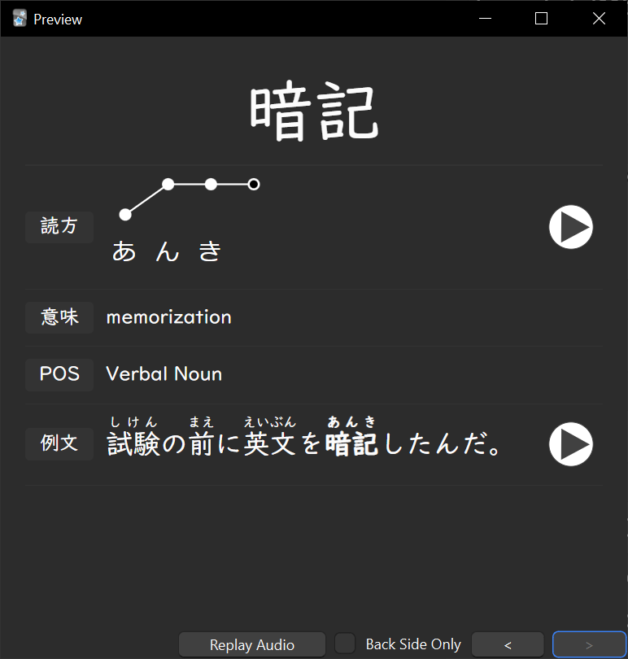
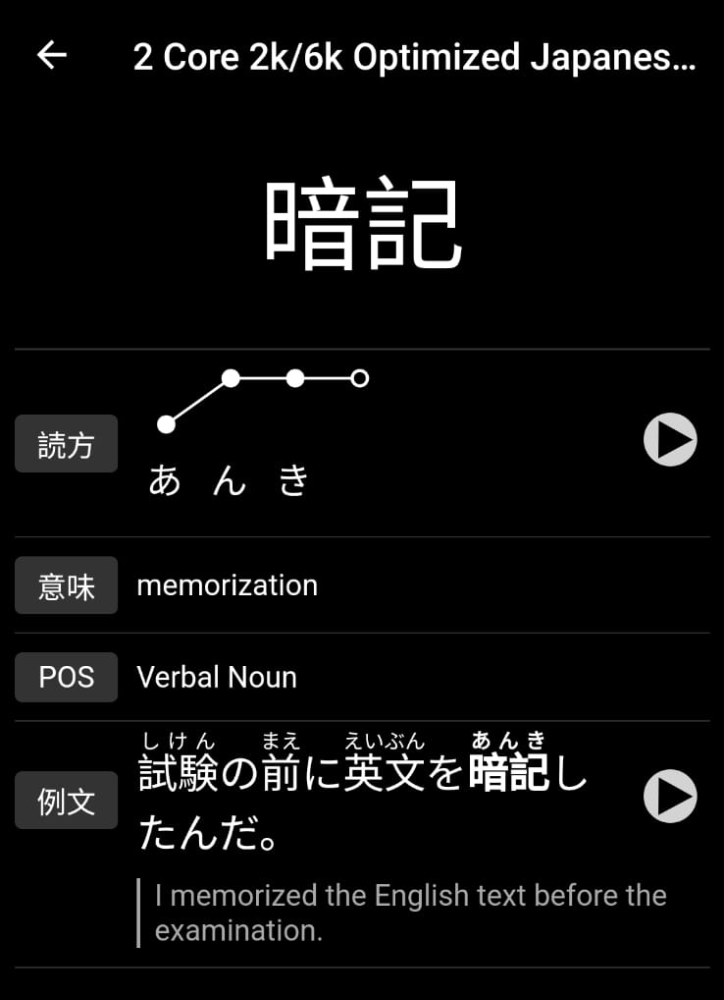

# Cado

A simple Anki card template for Core 2k/6k Japanese vocabulary decks

| Desktop                             | Android                             |
| ----------------------------------- | ----------------------------------- |
|  |  |

## Features

- Show kanji stroke order by tapping on the word
- Support for [Japanese Pitch Accent](https://ankiweb.net/shared/info/148002038) addon (optional)
- Show English translation for the example sentence by tapping on 例文
- Uses [UD デジタル教科書](https://www.morisawa.co.jp/topic/upg201802/) educational font for devices with it installed (e.g. Windows machines)
- Hopefully better organised information

## Installation

1. On your Anki client of choice, find "Manage Note Types" and edit the card for your Core 2k/6k note type
2. Paste the contents of [front.html](front.html), [back.html](back.html), and [style.css](style.css) into the respective fields
3. If necessary, update the [field replacements](https://docs.ankiweb.net/templates/fields.html) with those used by your deck

## Credits

- Kanji stroke order font ([source](https://www.nihilist.org.uk/)) ([copyright notice](.github/kanjistrokeorder-copyright.txt))
- Inspiration from the [Japanese Kanji Study app](https://play.google.com/store/apps/details?id=com.mindtwisted.kanjistudy)

## License

[GNU General Public License v3.0](LICENSE)
